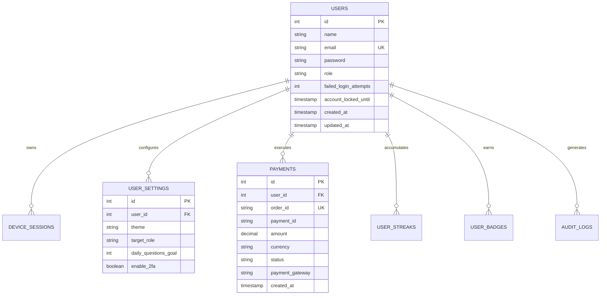
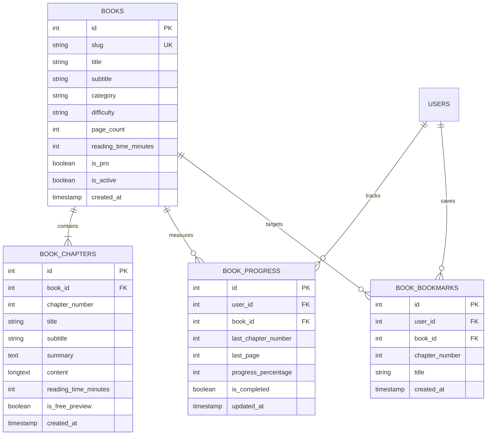
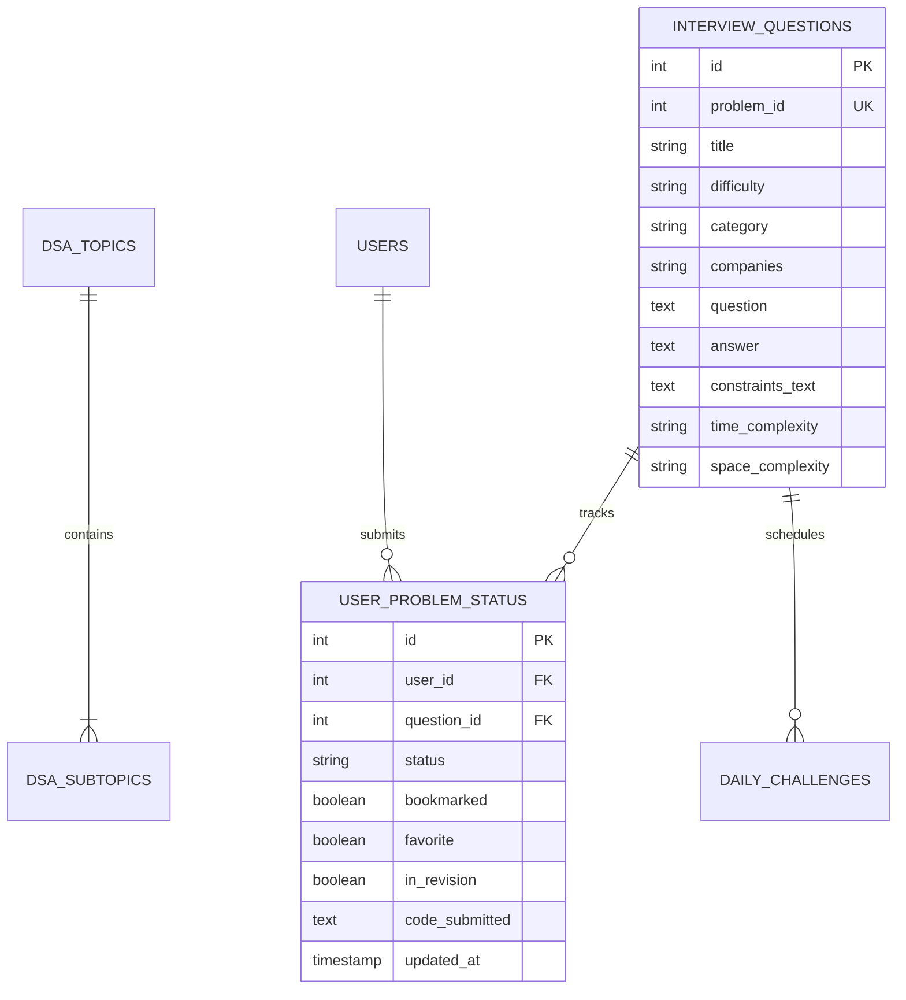

# PrepSpace — Database Architecture & Schema Specification

**Document Identifier**: `DOC-DB-004`  
**Version**: `1.0.0`  
**Status**: `AUTHORITATIVE / APPROVED`  
**Last Updated**: `2026-09-08`  
**Author**: Database Architect & Backend Engineering Group  
**Target Platform**: PrepSpace ([stream-in.app](https://stream-in.app))  

---

## 1. Database Architecture Overview

PrepSpace utilizes a relational persistence architecture powered by **MySQL 8.0** (with **H2 in-memory mode** for automated test execution). Hibernate 6 / Spring Data JPA serves as the Object-Relational Mapping (ORM) layer.

### Key Architectural Principles:
1. **Strict Referential Integrity**: Foreign keys enforce cascade deletes on user-owned transactional entities (`ON DELETE CASCADE`) to prevent orphaned rows upon account deletion.
2. **Defensive Indexing**: Indexes are placed on frequent lookup paths (`users.email`, `device_sessions.token_id`, `interview_questions.difficulty`, `book_chapters.book_id`, `job_applications.status`).
3. **Compound Uniqueness Constraints**: Unique keys enforce business rules at the schema level (`user_id + question_id`, `user_id + course_id`, `user_id + badge_id`).
4. **Audit Immutability**: Critical event entities (`audit_logs`, `webhook_logs`, `device_sessions`) record timestamps and IP addresses for compliance and forensic auditing.

---

## 2. Global Entity Relationship Diagrams (ERDs)

### 2.1 Core User, Authentication & Subscription ERD

---

### 2.2 Technical Library & Document Reading ERD

---

### 2.3 Coding Practice, Problems & Roadmap ERD

---

## 3. Authoritative Entity Data Dictionaries

### 3.1 Entity: `User` (`users`)
- **Purpose**: Master table for candidate and administrator credentials, roles, and security metadata.
- **Fields**:
  | Column Name | SQL Type | Nullable | Default | Keys / Constraints | Description |
  | :--- | :--- | :---: | :---: | :---: | :--- |
  | `id` | `INT` | NO | `AUTO_INCREMENT` | `PRIMARY KEY` | Unique synthetic identifier |
  | `name` | `VARCHAR(100)` | NO | None | None | Candidate full name |
  | `email` | `VARCHAR(100)` | NO | None | `UNIQUE`, Index | Login email address |
  | `password` | `VARCHAR(255)` | NO | None | None | BCrypt salted hash ($cost \ge 10$) |
  | `role` | `VARCHAR(20)` | NO | `'STUDENT'` | None | Role (`STUDENT`, `ADMIN`, `ADMIN_SUPER`) |
  | `failed_login_attempts`| `INT` | YES | `0` | None | Failed login attempts counter |
  | `account_locked_until` | `TIMESTAMP`| YES| `NULL` | None | Temporary account lockout expiry |
  | `created_at` | `TIMESTAMP` | NO | `CURRENT_TIMESTAMP` | None | Record creation timestamp |
  | `updated_at` | `TIMESTAMP` | NO | `CURRENT_TIMESTAMP` | None | Last profile update timestamp |

---

### 3.2 Entity: `Book` (`books`)
- **Purpose**: Stores textbook definitions across all 19 canonical learning domains.
- **Fields**:
  | Column Name | SQL Type | Nullable | Default | Keys / Constraints | Description |
  | :--- | :--- | :---: | :---: | :---: | :--- |
  | `id` | `INT` | NO | `AUTO_INCREMENT` | `PRIMARY KEY` | Unique book identifier |
  | `slug` | `VARCHAR(100)` | NO | None | `UNIQUE`, Index | URL-safe identifier (e.g. `dsa-core`) |
  | `title` | `VARCHAR(200)` | NO | None | None | Official textbook title |
  | `subtitle` | `VARCHAR(300)` | YES | None | None | Secondary descriptive subtitle |
  | `description` | `TEXT` | YES | None | None | High-level curriculum overview |
  | `author` | `VARCHAR(100)` | NO | None | None | Author / Engineering group |
  | `category` | `VARCHAR(50)` | NO | None | Index | Canonical domain identifier |
  | `difficulty` | `VARCHAR(20)` | NO | `'BEGINNER'` | Index | Difficulty tier |
  | `rating` | `FLOAT` | YES | `5.0` | None | Editorial quality rating ($1.0-5.0$) |
  | `page_count` | `INT` | NO | `100` | None | Total estimated book pages |
  | `reading_time_minutes` | `INT` | NO | `60` | None | Estimated total reading time |
  | `cover_color` | `VARCHAR(50)` | YES | None | None | CSS gradient theme for 3D card |
  | `is_pro` | `BOOLEAN` | NO | `FALSE` | None | Subscription paywall requirement flag |
  | `is_active` | `BOOLEAN` | NO | `TRUE` | None | Soft-delete / catalog visibility |
  | `created_at` | `TIMESTAMP` | NO | `CURRENT_TIMESTAMP` | None | Catalog registration timestamp |

---

### 3.3 Entity: `BookChapter` (`book_chapters`)
- **Purpose**: Stores textbook chapters, syllabus order, reading times, and full prose content.
- **Fields**:
  | Column Name | SQL Type | Nullable | Default | Keys / Constraints | Description |
  | :--- | :--- | :---: | :---: | :---: | :--- |
  | `id` | `INT` | NO | `AUTO_INCREMENT` | `PRIMARY KEY` | Unique chapter identifier |
  | `book_id` | `INT` | NO | None | `FOREIGN KEY` (`books.id`), Index | Parent book foreign key |
  | `chapter_number` | `INT` | NO | None | None | Sequence position ($1, 2, \dots, n$) |
  | `title` | `VARCHAR(200)` | NO | None | None | Chapter title |
  | `subtitle` | `VARCHAR(300)` | YES | None | None | Chapter topic subtitle |
  | `summary` | `TEXT` | YES | None | None | Chapter abstract / syllabus preview |
  | `content` | `LONGTEXT` | YES | None | None | Complete Markdown / HTML textbook prose |
  | `reading_time_minutes` | `INT` | NO | `20` | None | Estimated reading duration |
  | `is_free_preview`| `BOOLEAN` | NO | `FALSE` | None | Free Preview gate flag |
  | `created_at` | `TIMESTAMP` | NO | `CURRENT_TIMESTAMP` | None | Chapter creation timestamp |

---

### 3.4 Entity: `BookProgress` (`book_progress`)
- **Purpose**: Tracks candidate reading progress, last read chapter/page, and completion status.
- **Fields**:
  | Column Name | SQL Type | Nullable | Default | Keys / Constraints | Description |
  | :--- | :--- | :---: | :---: | :---: | :--- |
  | `id` | `INT` | NO | `AUTO_INCREMENT` | `PRIMARY KEY` | Unique progress identifier |
  | `user_id` | `INT` | NO | None | `FOREIGN KEY` (`users.id`), Index | Candidate reference |
  | `book_id` | `INT` | NO | None | `FOREIGN KEY` (`books.id`), Index | Textbook reference |
  | `last_chapter_number`| `INT` | NO | `1` | None | Highest chapter read |
  | `last_page` | `INT` | YES | `1` | None | Highest page reached |
  | `progress_percentage`| `INT` | NO | `0` | None | Overall book completion ($0-100\%$) |
  | `is_completed` | `BOOLEAN` | NO | `FALSE` | None | Completion flag |
  | `updated_at` | `TIMESTAMP` | NO | `CURRENT_TIMESTAMP` | None | Last reading activity timestamp |
  | **Constraint** | `UNIQUE(user_id, book_id)` | — | — | Unique Index | Enforces single progress record per book |

---

### 3.5 Entity: `Payment` (`payments`)
- **Purpose**: Records financial transactions, Cashfree order IDs, and payment verification audits.
- **Fields**:
  | Column Name | SQL Type | Nullable | Default | Keys / Constraints | Description |
  | :--- | :--- | :---: | :---: | :---: | :--- |
  | `id` | `INT` | NO | `AUTO_INCREMENT` | `PRIMARY KEY` | Unique payment record ID |
  | `user_id` | `INT` | NO | None | `FOREIGN KEY` (`users.id`), Index | Candidate reference |
  | `order_id` | `VARCHAR(100)` | NO | None | `UNIQUE`, Index | Cashfree order identifier |
  | `payment_id` | `VARCHAR(100)` | YES | None | None | Cashfree transaction settlement ID |
  | `amount` | `DECIMAL(10,2)`| NO | None | None | Payment amount (e.g. `499.00`) |
  | `currency` | `VARCHAR(10)` | NO | `'INR'` | None | ISO Currency code |
  | `status` | `VARCHAR(50)` | NO | `'PENDING'` | Index | Status (`SUCCESS`, `PENDING`, `FAILED`)|
  | `payment_gateway` | `VARCHAR(50)` | NO | `'CASHFREE'` | None | Gateway provider |
  | `created_at` | `TIMESTAMP` | NO | `CURRENT_TIMESTAMP` | None | Transaction initiation timestamp |

---

### 3.6 Remaining Entities Index
- **`job_applications`**: `id`, `user_id`, `company`, `role`, `status` (`Wishlist`, `Applied`, `Interviewing`, `Offered`, `Rejected`), `applied_date`, `notes`.
- **`interview_questions`**: `id`, `problem_id`, `title`, `difficulty`, `category`, `companies`, `question`, `answer`, `constraints_text`, `hints`, `optimal_approach`, `time_complexity`, `space_complexity`.
- **`user_problem_status`**: `id`, `user_id`, `question_id`, `status` (`UNSOLVED`, `ATTEMPTED`, `SOLVED`), `bookmarked`, `code_submitted`, `updated_at`.
- **`courses` & `lessons`**: Course catalog definitions, video links, assignments, sequence numbers.
- **`certificates`**: `id`, `user_id`, `course_id`, `certificate_id` (UK), `student_name`, `course_name`, `verification_url`, `qr_code`.
- **`flashcards`**: `id`, `user_id`, `question`, `answer`, `repetitions`, `interval_days`, `ease_factor`, `next_review_date`.
- **`rich_notes` & `folders`**: `id`, `user_id`, `folder_id`, `title`, `content`, `tags`, `markdown_enabled`.
- **`audit_logs` & `device_sessions`**: Session tokens, IP addresses, user agents, action logs.

---

## 4. Migration & Integrity Rules

1. **Hibernate Schema Mode**: `spring.jpa.hibernate.ddl-auto=update` performs safe additions of columns and tables without destructively dropping existing production records.
2. **Character Set**: Strict `utf8mb4` encoding across all text columns to support international symbols, emojis, and mathematical notations.
3. **Database Timezone**: `serverTimezone=UTC` ensures timezone-agnostic timestamps across cloud hosting environments.
