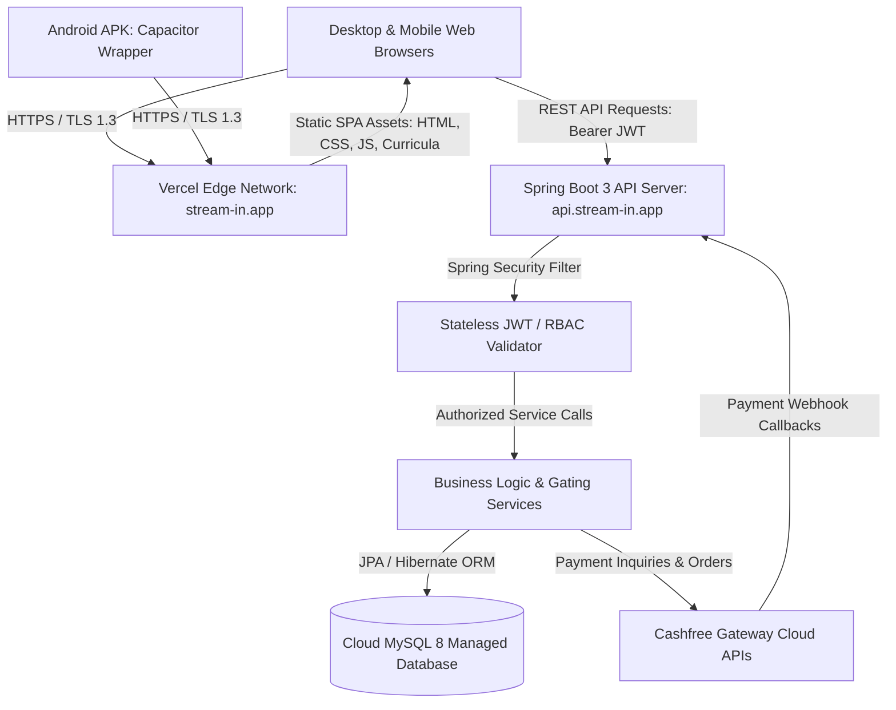
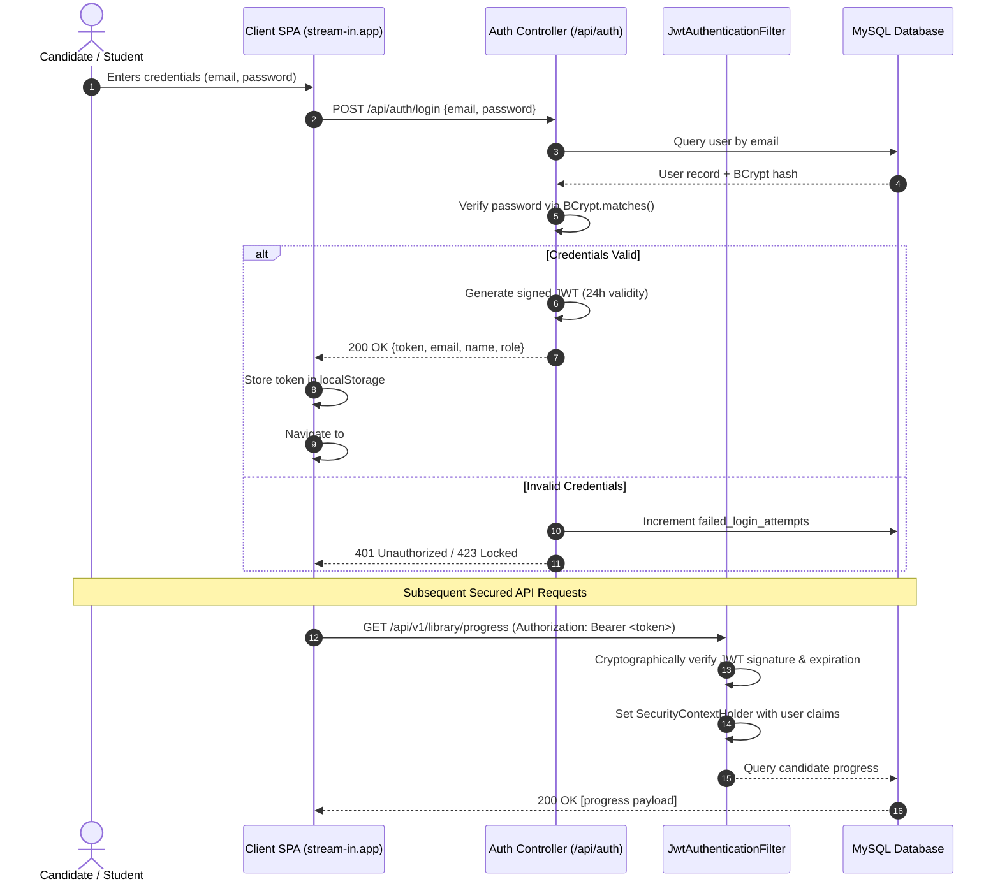
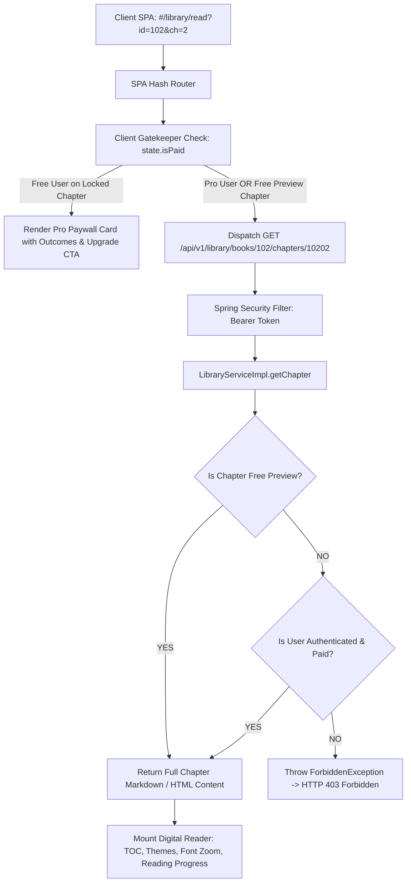
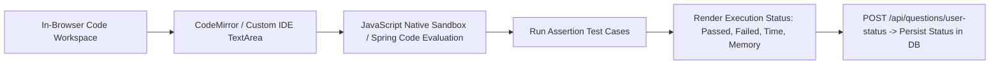
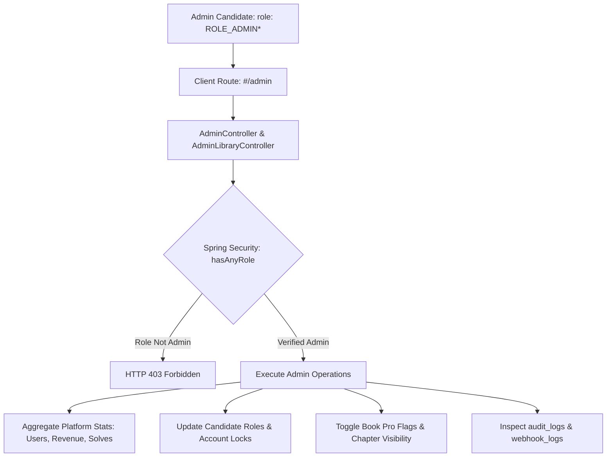
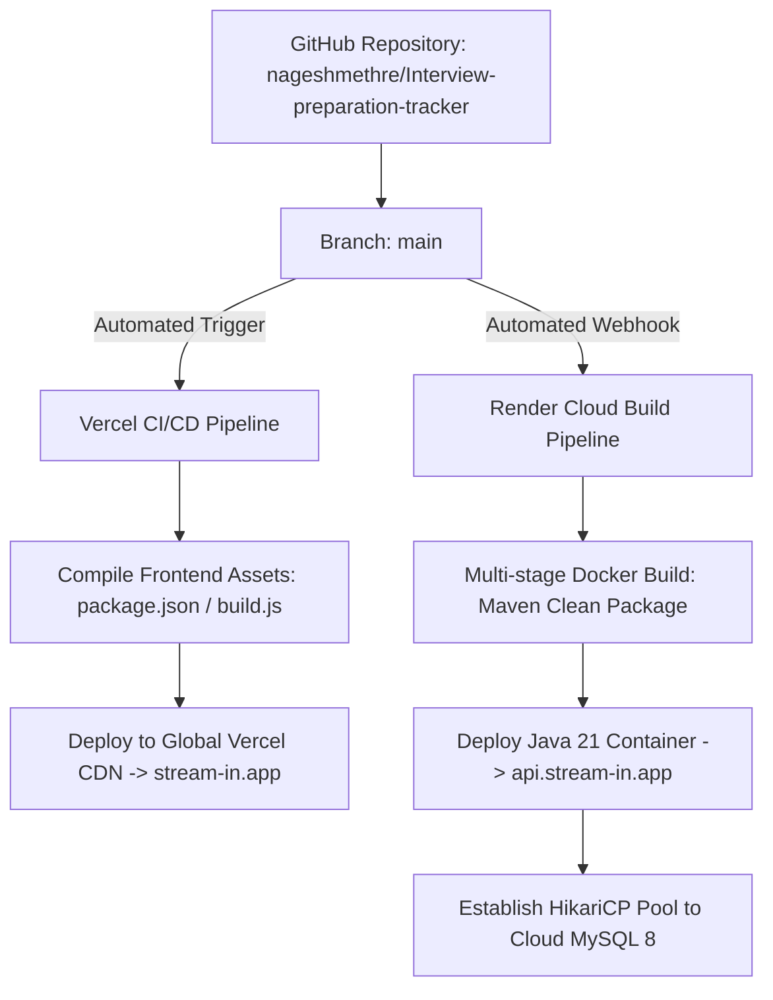

# PrepSpace — System Architecture Specification

**Document Identifier**: `DOC-ARCH-005`  
**Version**: `1.0.0`  
**Status**: `AUTHORITATIVE / APPROVED`  
**Last Updated**: `2026-09-08`  
**Author**: Principal Software Architect & DevOps Group  
**Target Platform**: PrepSpace ([stream-in.app](https://stream-in.app))  

---

## 1. High-Level Architecture Overview

PrepSpace employs a **Decoupled Edge-First Cloud Architecture**. The user interface is delivered via an edge-replicated static Single-Page Application (SPA) on Vercel, which communicates with a scalable Spring Boot REST API container running on Render/Railway, backed by a persistent Cloud MySQL database.



---

## 2. Authentication & Session Architecture

Authentication is entirely stateless, utilizing **HMAC-SHA256 Signed JSON Web Tokens (JWT)**.



---

## 3. Subscription & Payment Lifecycle Architecture

PrepSpace implements an end-to-end cryptographic subscription verification loop using **Cashfree Payment Gateway**.

```mermaid
sequenceDiagram
    autonumber
    actor User as Free Candidate
    participant UI as PrepSpace Client
    participant API as PaymentController (/api/payments)
    participant CF as Cashfree Cloud Gateway
    participant DB as MySQL Database

    User->>UI: Clicks "Upgrade to PrepSpace Pro" (₹499)
    UI->>API: POST /api/payments/cashfree/create-order
    API->>CF: Create Order (amount, customer_details)
    CF-->>API: 200 OK {payment_session_id, order_id}
    API->>DB: Insert pending Payment record (status: 'PENDING')
    API-->>UI: Return payment_session_id
    UI->>CF: Mount Cashfree Checkout Modal (SDK v3)
    User->>CF: Completes payment (UPI / Card / NetBanking)
    CF-->>UI: Redirect with order_id to #/payment-success
    
    par Asynchronous Webhook Validation
        CF->>API: POST /api/payments/cashfree/webhook (Webhook Signature Header)
        API->>API: Verify HMAC-SHA256 signature using Cashfree Secret
        API->>DB: Update Payment record (status: 'SUCCESS')
        API->>DB: Update User record (role: 'ROLE_STUDENT', isPaid: true)
    and Client Verification
        UI->>API: POST /api/payments/cashfree/verify {order_id}
        API->>CF: Query order status
        CF-->>API: Verified PAID
        API-->>UI: 200 OK {status: 'SUCCESS'}
        UI->>UI: Update state.isPaid = true; Unlocks Pro access
    end
```

---

## 4. Technical Library & Digital Document Reader Architecture

The Technical Library architecture delivers original, deep textbooks across 19 canonical domains, enforcing subscription gating at the service layer:



---

## 5. Coding Practice IDE & Evaluation Architecture



- **Execution Model**: Javascript algorithmic solutions execute in a sandboxed Web Worker preventing main-thread UI freezing. Multi-language submissions (Java, Python, C++) leverage pre-compiled test runners executing against standard I/O test fixtures.
- **Progress Tracking**: Status is stored in `user_problem_status`, updating the candidate's aggregate score, streak, and daily goal telemetry.

---

## 6. Super Admin Architecture



---

## 7. CI/CD & Deployment Architecture



---

## 8. Security Boundaries & Threat Modeling

1. **Edge Perimeter**: Vercel Edge Network provides global DDoS mitigation, HTTPS enforcement, and static asset caching.
2. **Transport Security**: Mandatory TLS 1.3 encryption across all client-to-API and API-to-database connections.
3. **Application Perimeter**: Spring Security stateless filter intercepts all requests under `/api/**`, enforcing JWT signature validity and role-based permissions.
4. **Data Perimeter**: MySQL database resides in an isolated private cloud network accessible only via authorized IP allowlists with SSL certificates.
