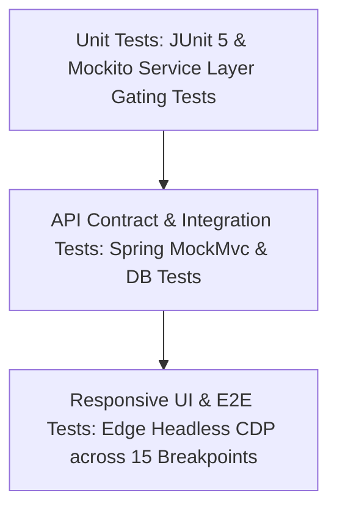

# PrepSpace — Quality Assurance & Test Strategy

**Document Identifier**: `DOC-TEST-008`  
**Version**: `1.0.0`  
**Status**: `AUTHORITATIVE / APPROVED`  
**Last Updated**: `2026-09-08`  
**Author**: QA / Test Architect & Automation Engineering Group  
**Target Platform**: PrepSpace ([stream-in.app](https://stream-in.app))  

---

## 1. Testing Philosophy & Test Pyramid

The PrepSpace Quality Assurance strategy employs a multi-tiered testing pyramid designed to catch defects at the lowest possible cost, validating business rules at the unit layer, contract fidelity at the API layer, and zero visual overflow at the responsive UI layer.



---

## 2. Automated Test Catalog & Identifiers

### 2.1 Authentication & Security Tests (`TEST-AUTH`)
| Test ID | Test Name | Target Layer | Expected Outcome |
| :--- | :--- | :--- | :--- |
| **`TEST-AUTH-001`** | User Registration Success | Unit / Service | Persists user record, hashes password with BCrypt, returns `STUDENT` role. |
| **`TEST-AUTH-002`** | Duplicate Email Rejection | Unit / API | Rejects duplicate registration with `400 Bad Request`. |
| **`TEST-AUTH-003`** | Valid Login JWT Issuance | Unit / Integration | Returns valid signed JWT containing correct `sub` and `role` claims. |
| **`TEST-AUTH-004`** | Invalid Password Rejection | Unit / Integration | Rejects incorrect password with `401 Unauthorized`. |
| **`TEST-AUTH-005`** | Brute Force Account Lockout | Service / DB | Locks account for 15 minutes after 5 consecutive failed attempts (`423 Locked`). |

### 2.2 Subscription & Gating Tests (`TEST-SUB`)
| Test ID | Test Name | Target Layer | Expected Outcome |
| :--- | :--- | :--- | :--- |
| **`TEST-SUB-001`** | Free Preview Chapter Access | Service / API | Free candidate accesses Chapter 1 (`isFreePreview == true`) receiving full content. |
| **`TEST-SUB-002`** | Pro Chapter Denied to Free User | Service / API | Non-paying candidate accessing Pro chapter receives **HTTP 403 Forbidden**. |
| **`TEST-SUB-003`** | Pro Chapter Allowed for Paid User | Service / API | Paid candidate (`isPaid == true`) accesses Pro chapter successfully (`200 OK`). |
| **`TEST-SUB-004`** | Admin Bypass Pro Paywall | Service / API | User with `ROLE_ADMIN` accesses all chapters regardless of payment status. |
| **`TEST-SUB-005`** | Webhook Signature Verification | Integration / API | Rejects webhooks with forged or missing signatures (`400 Bad Request`). |

### 2.3 Technical Library Tests (`TEST-LIB`)
| Test ID | Test Name | Target Layer | Expected Outcome |
| :--- | :--- | :--- | :--- |
| **`TEST-LIB-001`** | Catalog Delivery | Unit / Service | Returns all active books with accurate chapter counts and difficulty levels. |
| **`TEST-LIB-002`** | Reading Progress Persisted | Service / DB | Candidate reading position and completion percentage accurately saved. |
| **`TEST-LIB-003`** | Bookmark Management | Service / DB | Adding, listing, and removing bookmarks execute cleanly without duplicates. |

### 2.4 Responsive Layout & Overflow Tests (`TEST-RESP`)
| Test ID | Test Name | Viewport Tested | Verification Formula |
| :--- | :--- | :---: | :--- |
| **`TEST-RESP-001`** | Mobile SE Zero Overflow | $320\times 568$ | `document.documentElement.scrollWidth <= 320` |
| **`TEST-RESP-002`** | Mobile iPhone Zero Overflow | $375\times 812$ | `document.documentElement.scrollWidth <= 375` |
| **`TEST-RESP-003`** | Mobile Plus Zero Overflow | $414\times 896$ | `document.documentElement.scrollWidth <= 414` |
| **`TEST-RESP-004`** | Tablet Portrait Zero Overflow | $768\times 1024$ | `document.documentElement.scrollWidth <= 768` |
| **`TEST-RESP-005`** | Desktop Standard Zero Overflow | $1440\times 900$ | `document.documentElement.scrollWidth <= 1440` |

---

## 3. Automated Test Execution Harness

### 3.1 Backend Test Execution
Executed via Apache Maven against the JUnit 5 test suite:
```bash
mvn test -Dtest=LibraryServiceTests,QuestionServiceTests
```
*Current Suite Results*: **9/9 Unit Tests Passing (100% Success Rate)**.

### 3.2 Responsive Browser Automation
Executed via Microsoft Edge Headless CDP test harnesses:
- Injects test session tokens before DOM parsing.
- Navigates through target routes (`#/library`, `#/library/book?id=101`, `#/library/read?id=101&ch=1`).
- Evaluates DOM metrics (`scrollWidth` vs `innerWidth`).
- Captures high-resolution artifact screenshots for visual QA inspection.
